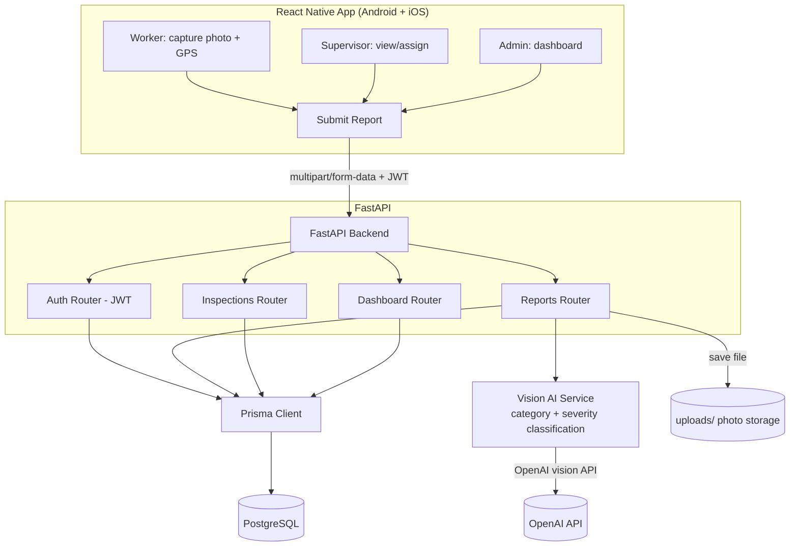

# SafetyCheck Backend

Python (FastAPI) + PostgreSQL + **Prisma ORM** backend for a factory/facility
**safety inspection & compliance platform**. Workers report hazards via
photo, AI classifies category + severity, supervisors get notified and
assign fixes, and admins see a live compliance dashboard.

Companion mobile app: `safetycheck-mobile` (React Native CLI, Android + iOS).

## Why this product

Companies today need this because:
- Occupational safety compliance is a **legal requirement** (Factories Act /
  OSH Code) — a paper trail of inspections and fixes is what protects a
  company if an accident happens.
- Manual paper/Excel-based safety walks are slow, easy to fake, and give no
  real-time visibility to management.
- A live dashboard showing "3 CRITICAL issues open for 5+ days at Plant 2"
  is the kind of number a safety officer/COO will pay a monthly subscription
  for.

## Architecture



**Flow for a single report:** worker takes a photo in the app → uploads with
GPS + site ID → backend saves the photo, calls the vision model to get
`category` + `severity` → report is stored as `OPEN` → appears instantly on
the supervisor's app and the admin dashboard → supervisor assigns it →
status moves `ACKNOWLEDGED → IN_PROGRESS → RESOLVED`.

## Quick start (you already have local Postgres)

```bash
cd safetycheck-backend
python -m venv venv && source venv/bin/activate   # Windows: venv\Scripts\activate
pip install -r requirements.txt

cp .env.example .env
# edit .env:
#   DATABASE_URL -> point at your local Postgres (create a `safetycheck` DB first)
#   OPENAI_API_KEY -> optional, leave blank to use the classification stub

# Generate the Prisma client (needs internet once, to fetch the query engine binary)
prisma generate

# Create the tables from schema.prisma
prisma db push

# Seed sample company/site/users/checklist
python seed.py

# Run the API
uvicorn app.main:app --reload
```

API live at `http://localhost:8000`, interactive docs at
`http://localhost:8000/docs`.

Create the DB first if it doesn't exist:
```bash
psql -U postgres -c "CREATE DATABASE safetycheck;"
```

## Key endpoints

| Method | Path                                | Purpose |
|--------|--------------------------------------|---------|
| POST   | `/auth/register`                    | Create a user (worker/supervisor/admin) |
| POST   | `/auth/login`                       | Get a JWT access token |
| POST   | `/sites`                            | Create a site/facility (admin) |
| GET    | `/sites`                            | List sites |
| POST   | `/reports`                          | Upload a photo report, runs the AI pipeline |
| GET    | `/reports`                          | List reports (filter by `site_id`, `status`, `severity`) |
| PATCH  | `/reports/{id}/status`              | Update status (supervisor/admin) |
| PATCH  | `/reports/{id}/assign`              | Assign to a user (supervisor/admin) |
| POST   | `/checklist-templates`              | Create a reusable inspection checklist |
| POST   | `/inspections`                      | Start an inspection run |
| POST   | `/inspections/{id}/items`           | Record pass/fail for a checklist item |
| POST   | `/inspections/{id}/complete`        | Mark inspection complete |
| GET    | `/dashboard/stats`                  | Compliance metrics for the admin dashboard |

Example login + report upload:

```bash
TOKEN=$(curl -s -X POST http://localhost:8000/auth/login \
  -H "Content-Type: application/json" \
  -d '{"email":"worker@example.com","password":"worker123"}' | python3 -c "import sys,json;print(json.load(sys.stdin)['access_token'])")

curl -X POST http://localhost:8000/reports \
  -H "Authorization: Bearer $TOKEN" \
  -F "photo=@/path/to/hazard.jpg" \
  -F "site_id=1" \
  -F "latitude=22.72" \
  -F "longitude=75.87" \
  -F "location=Bay 3, Line 2"
```

## What's a stub vs. real

- **Vision classification** (`app/services/vision.py`): calls OpenAI's
  vision API if `OPENAI_API_KEY` is set; otherwise returns a fixed stub
  result (`OTHER` / `MEDIUM`) so you can test the pipeline for free.

## Production checklist (before selling this to a company)

- [ ] Move photo storage to S3/GCS instead of local disk
- [ ] Move `prisma migrate dev` into CI/CD instead of `db push` for real deployments
- [ ] Background task queue (Celery/RQ) so photo upload responds instantly
      and AI classification happens async, with a push notification on result
- [ ] Push notifications (FCM) for CRITICAL severity reports
- [ ] Rate limiting + file-size/type validation on uploads
- [ ] Multi-tenant row-level checks (a user should only see their own company's data)
- [ ] Structured logging + error tracking (Sentry)
- [ ] Lock down CORS `allow_origins`
- [ ] PDF compliance report export (per site, per month) — this is a strong
      selling point for admins who need to show inspectors/auditors a report

## Tech stack

- **FastAPI** — async Python web framework
- **Prisma (prisma-client-py)** — type-safe ORM, schema in `prisma/schema.prisma`
- **PostgreSQL** — your local instance
- **JWT (python-jose)** — auth
- **httpx** — calls out to the vision AI provider
